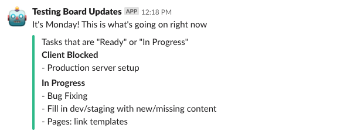
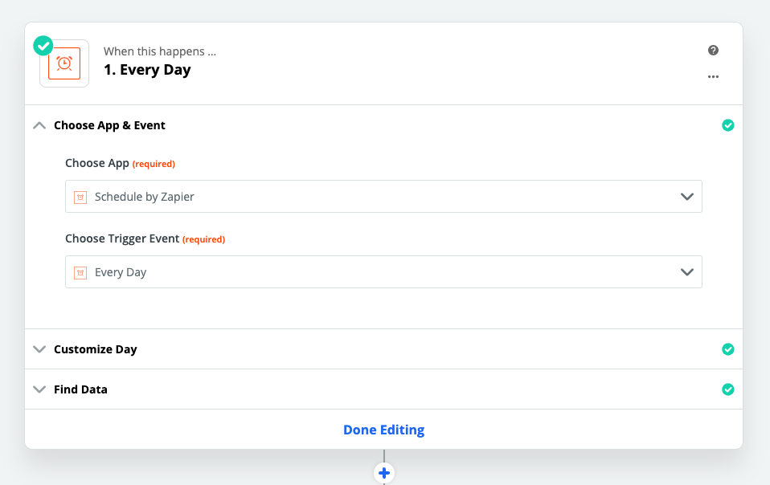
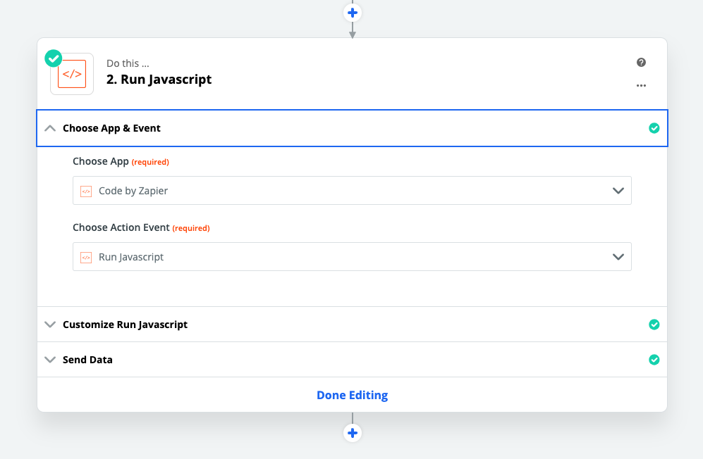
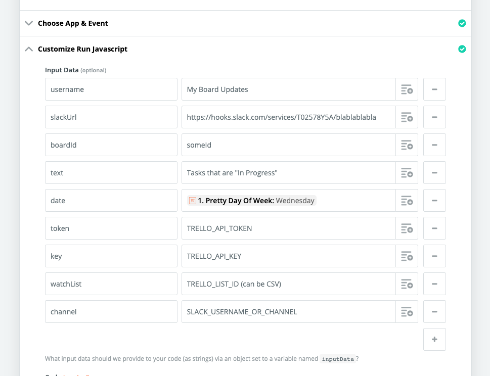
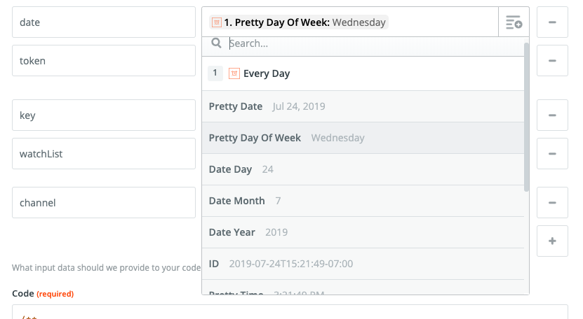

trello-zapier-slack-report
==============================

> Run a daily Trello report in Slack using a scheduled Zapier task



## Prerequisites

* [Slack webhook](https://api.slack.com/incoming-webhooks#create_a_webhook)
* Trello board with lists and tasks setup
* [Trello API Key](https://trello.com/app-key)
* Trello API token (you can generate one on the link above)
* [Zapier](https://zapier.com/) account (free or paid)

### Testing

* Make a config: `cp credentials-example.json credentials.json`
* Fill out `credentials.json`
* `npm run test`
* You should get a Slack notification

### Setting Up In Zapier

* Create a new zap
* Start with "Schedule By Zapier"
* Choose a trigger
* Next, choose "Code By Zapier"
* Select "Run Javascript"
* Modify the input data as follows:

```
date - the current day of the week (use the data picker to select the output of the schedule zap, see "Screen 4" below)
channel - name of the slack channel to post to
username - name of the bot
boardId - id of the Trello board to post to
key - Trello API key
token - Trello API token
watchList - Trello list to report on (single value OR comma-separated)
slackUrl - The webhook URL for Slack
```

#### Setup The Schedule



#### Setup The Code Task



#### Setup The Code Task (part 2)



#### Setup The Code Task (part 3)


